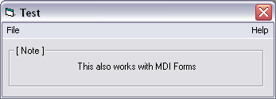



## Move last top menu to the right

### Description

Dock the most right top menu to the right of a form. Check the screenshot.
 
### More Info
 
Find portions of the code on PSC. Freshen it up a bit and made it more generic.

             |
---                |---
**Submitted On**   |2005-02-22 08:55:18
**By**             |[AndreB](https://github.com/Planet-Source-Code/PSCIndex/blob/master/ByAuthor/andreb.md)
**Level**          |Intermediate
**User Rating**    |4.0 (16 globes from 4 users)
**Compatibility**  |VB 6\.0
**Category**       |[Custom Controls/ Forms/  Menus](https://github.com/Planet-Source-Code/PSCIndex/blob/master/ByCategory/custom-controls-forms-menus__1-4.md)
**World**          |[Visual Basic](https://github.com/Planet-Source-Code/PSCIndex/blob/master/ByWorld/visual-basic.md)
**Archive File**   |[Move\_last\_1856382222005\.zip](https://github.com/Planet-Source-Code/andreb-move-last-top-menu-to-the-right__1-59092/archive/master.zip)

